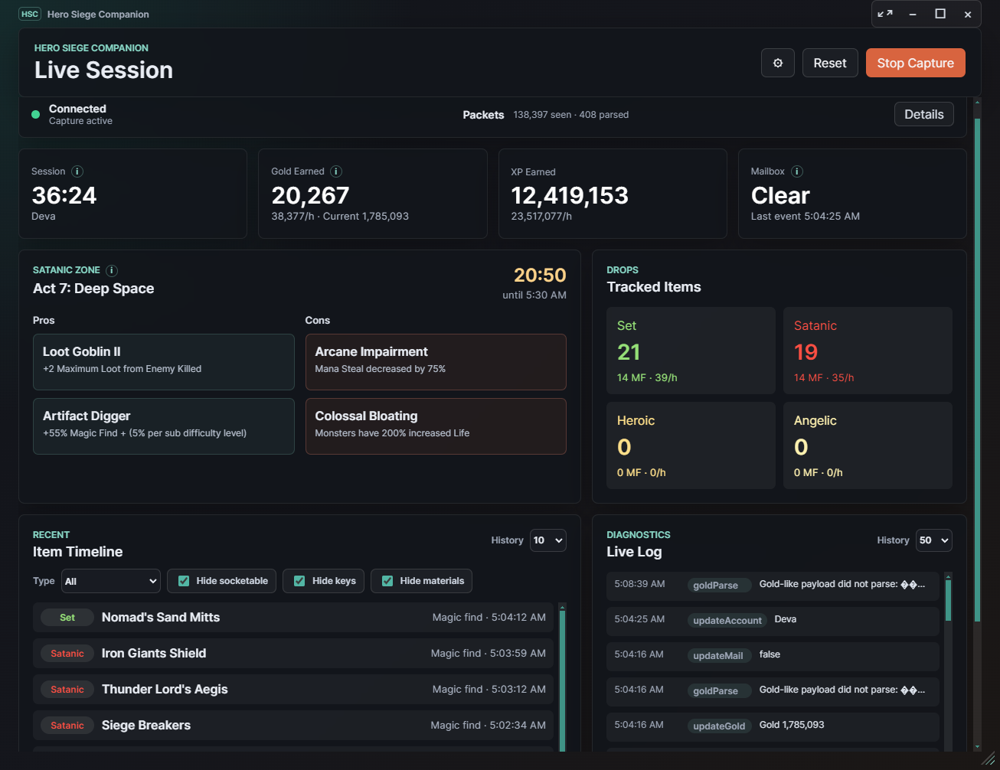
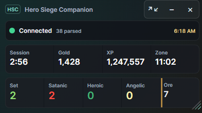
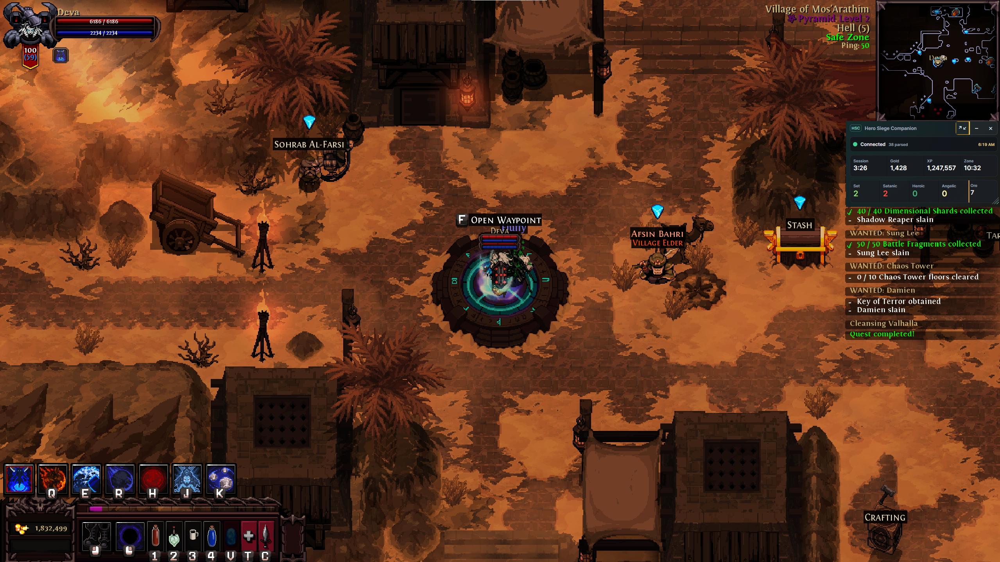
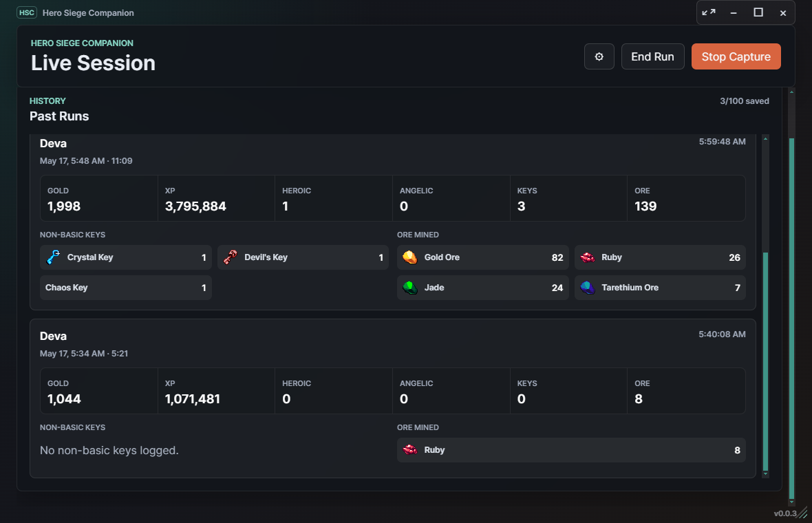
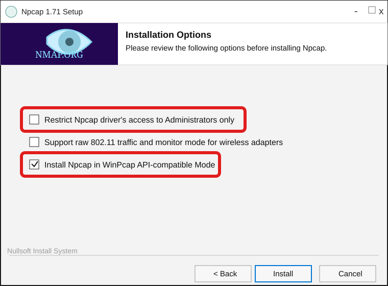

# Hero Siege Companion

Passive live-session tracking for Hero Siege on Windows.

Hero Siege Companion watches local Hero Siege traffic, parses the game messages it understands, and turns the useful bits into a clean desktop dashboard: session time, gold and XP rates, mailbox status, Satanic Zone details, tracked drops, item history, run history, and capture diagnostics.

**Requires Npcap:** install Npcap before running the app so Hero Siege Companion can read local game traffic. See [Required: Install Npcap](#required-install-npcap) for the recommended installer settings.



## Download

Download the latest Windows build from the GitHub Releases page:

[Hero Siege Companion Releases](https://github.com/DemonSkye/Hero-Siege-Companion/releases)

The release asset is the portable Windows build. Download it, unzip it if needed, and run `Hero Siege Companion.exe`.

Current release target: `v0.0.6`.

## Features

- Live capture status with packet and parse counts.
- Session timer, character name, gold earned, current gold, XP earned, and per-hour rates.
- Mailbox state detection from game packets.
- Satanic Zone name, reset countdown, pros, and cons.
- Tracked drop counters for Set, Satanic, Heroic, Angelic, non-basic keys, and mined ore.
- Item timeline with filters for item type, keys, socketables, materials, and material-like collectibles.
- Expandable diagnostics log with color-coded event labels.
- Past Runs explorer with high-level local summaries for gold, XP, duration, keys, ore, Heroic drops, and Angelic drops.
- Compact overlay mode for keeping the important numbers visible while playing.
- Local-only desktop app: no account login, no cloud service, and no packet capture files are written by the app.

## Compact Overlay

Compact mode shrinks the companion down to a small overlay-friendly view with connection status, clock, session timer, gold, XP, zone countdown, tracked drops, and ore.



It can also sit over the game while staying small enough to keep the playfield readable.



## Past Runs

Click `End Run` to save a local summary of the current session and reset the live counters. Closing the app also saves the current run, subject to your run-history settings.

Past Runs keeps up to 100 summaries and stores only high-level stats, not packet captures.



## Required: Install Npcap

Hero Siege Companion uses the Windows packet capture driver provided by Npcap. Install Npcap before running the app.

Download Npcap from the official Nmap/Npcap site:

[https://npcap.com/](https://npcap.com/)

During setup, use these options:

- Leave **Restrict Npcap driver's access to Administrators only** unchecked.
- Check **Install Npcap in WinPcap API-compatible Mode**.
- The raw 802.11 wireless option is not required for Hero Siege Companion.



If capture does not start, reinstall Npcap with the WinPcap-compatible option enabled, then restart Hero Siege Companion.

## How To Use

1. Install Npcap using the settings above.
2. Start Hero Siege.
3. Launch `Hero Siege Companion.exe`.
4. Leave the companion running while you play.
5. Use the timeline filters to hide noisy item categories such as keys, socketables, and materials.
6. Use `End Run` when a run is over and you want it saved to Past Runs.

The app only displays information after Hero Siege sends the relevant packet. For example, gold and mailbox state may update after changing zones or visiting town, and Satanic Zone data appears after the game sends a zone packet.

## Development

Install dependencies:

```powershell
$env:npm_config_cache='.npm-cache'
npm install --ignore-scripts
```

Install Electron into the local cache:

```powershell
$env:electron_config_cache=(Join-Path (Get-Location) '.electron-cache')
node .\node_modules\electron\install.js
```

Rebuild the native packet capture module. This requires Python on your `PATH`; Python 3.10+ is a good default on Windows.

```powershell
npx electron-rebuild -f -w cap
```

If Python is installed but not on `PATH`, point npm at your local `python.exe` first:

```powershell
$env:npm_config_python='C:\Path\To\Python\python.exe'
npx electron-rebuild -f -w cap
```

Run the app:

```powershell
npm start
```

Run tests:

```powershell
npm test
```

Build the portable Windows release:

```powershell
npm run dist:win
```

## Notes

Npcap is developed by the Nmap Project. Hero Siege Companion is not affiliated with Hero Siege, Panic Art Studios, Nmap, or Npcap.
