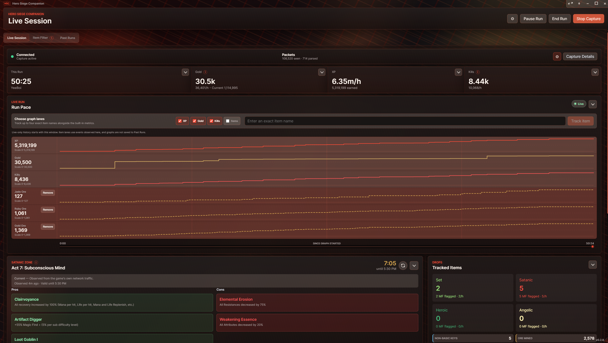
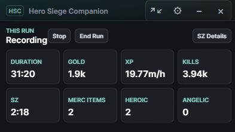
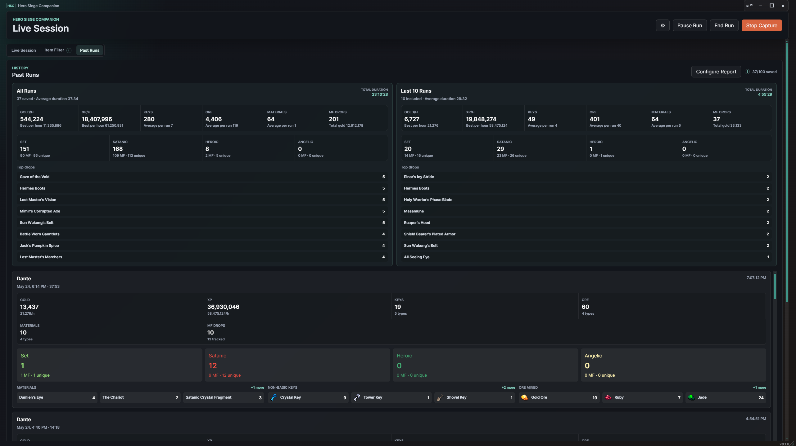
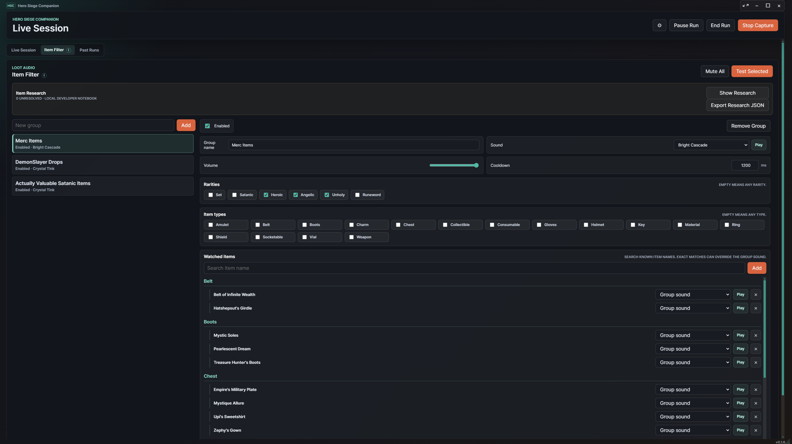
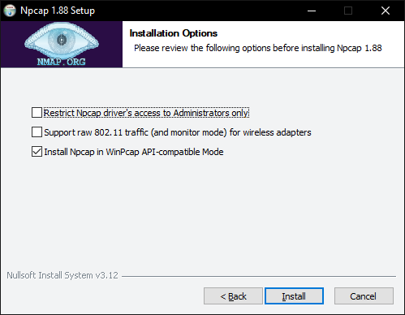

# Hero Siege Companion

Local live-session tracking for Hero Siege on Windows.

Hero Siege Companion passively watches local Hero Siege traffic, parses the game messages it understands, and turns them into three focused full-size tools: the Live Session dashboard, Filter Stack for loot alerts, and Report Desk for saved runs. A compact current-run overlay and an optional, default-off manual Satanic Zone refresh are also available.

> **Required before first launch:** install [Npcap](https://npcap.com/#download) so the companion can read local game traffic. The exact installer options are in [Required: Install Npcap](#required-install-npcap).



## Download

Download the latest Windows build from the GitHub Releases page:

[Hero Siege Companion Releases](https://github.com/DemonSkye/Hero-Siege-Companion/releases)

The release asset is the portable Windows build. Download it, unzip it if needed, and run `Hero Siege Companion.exe`.

Current release target follows the `version` field in `package.json`.

## Quick Start

1. Install [Npcap](https://npcap.com/#download) using the options shown below.
2. Launch `Hero Siege Companion.exe`.
3. If you use manual Satanic Zone refresh, install its optional dependency and enable the feature now.
4. Start Hero Siege and leave capture running while you play.
5. Use `End Run` when a run is complete and should be saved to Past Runs.

Most data appears after Hero Siege sends the relevant packet. For example, gold may update after a zone change or town interaction, and Satanic Zone details normally arrive during world entry or through a later passive/manual update.

If you opt into manual Satanic Zone refresh, enable it in **Settings > Features** before Hero Siege connects. If the game is already connected, reconnect or restart it so the local relay can attach.

## Core Features

- Live Session dashboard with capture status, packet counts, run timer, gold, XP, kills, readable Satanic Zone effects, tracked drops, and persistent timeline filters.
- Collapsible Run Pace charts with individually hideable XP, gold, kills, and observed-item lanes, up to four removable exact-item lanes, and a shared exact-value inspector for the current live run.
- Run pause/resume controls, including automatic run pause when capture stops.
- Compact overlay mode for keeping the current run visible while playing, with tile presets and custom item/filter counters configured from the compact gear.
- Satanic Zone name, reset countdown, pros, cons, and freshness status in both full and compact views.
- Optional recycle-style Satanic Zone refresh icon beside the full-view countdown and the configured compact SZ timer tile, hidden until enabled and gated for exactly 30 seconds from each accepted refresh handoff.
- Filter Stack loot alerts with independently collapsible groups, concise rule/sound summaries, rarity/type rules, exact watched items, volume, cooldown, and prominent global mute.
- Contextual Sound Library for built-in previews, imported local audio or zip soundpacks, usage-aware removal, and soundpack ZIP export; Filter Packs carry only the custom sounds their groups use.
- Dark, Demonsteel, Voidglass, Reliquary, Cyberpunk, and Quicksilver themes with canonical full-app and compact choices. Custom theme files are the advanced escape hatch; ordinary accent controls are not exposed.
- Shopping list for quickly saving and copying marketplace searches.
- Report Desk for Past Runs, with aggregate-first reporting, desktop master/detail navigation, responsive Back navigation, contextual run actions, search and tags, JSON/CSV export, Discord-friendly summary copy, report presets, linked Filter Stack groups, and resource/drop detail.
- One autosaving Settings ledger organized into App, Appearance, Features, Help & Support, and Developers; there is no Apply or Done step.
- Full backup and restore with a read-only preview and explicit confirmation for supported settings, item filters, imported sounds, custom themes, reports/layouts, and dashboard fixture visibility.
- Player-facing Item Research is retired. If legacy authored entries still exist, Developers offers a one-time export and clears them from current preferences only after that export succeeds.
- Support diagnostics summary copy, log folder opening, and sanitized ZIP export with app-session state and Crashpad report metadata (never dump memory) for troubleshooting capture/setup issues.
- Local-only desktop app: no account login, no cloud service, and no packet capture files are written by the app.

## Live Dashboard

The full-size Live Session tab keeps the **Run Command** information hierarchy without a separate Run Command banner. Its fixed run score keeps duration, gold, XP, and kills visible, while the support rail keeps high-rarity drop totals and diagnostics nearby. Capture details stay behind a contextual disclosure. Satanic Zone pros and cons sit in separate columns; within each column, every effect stacks a human-readable title over a short explanation.

The full-width, collapsible **Run Pace** graph sits between the score strip and the dashboard. It uses pause-aware time since graph tracking began and draws independently scaled step lanes for XP, gold, kills, and observed items. Each built-in lane can be shown or hidden, and you can add or remove up to four exact-item lanes from catalog suggestions or a freeform name; exact matching ignores case and diacritics. Hovering the graph shows a synchronized exact time/value readout for every visible lane, with the same inspection available from the keyboard time control. Its App-owned live history remains available when you switch tabs, resets its values for each new run while retaining the lane choices, and is not saved into Past Runs. If the renderer starts or recovers during an existing run, the graph begins with the hydrated current snapshot instead of inventing earlier history; item lanes use the item events visible to and subsequently observed by that graph.

Item Timeline and Live Log are collapsible dashboard fixtures. Ordinary card collapse lasts for the current session. Hiding either fixture is a saved choice, and a gear-only dashboard customizer in the capture status row restores hidden fixtures. Item Timeline filters are also saved, including the socketable, key, material, unfiltered, type, and linked-filter choices.

Satanic Zone details use the same current-run source data in full and compact mode: zone name, remaining time, pros, and cons come from fresh parsed game packets or the optional sanitized manual-refresh result. The Companion does not restore a prior zone, effects, source, or observation time when it launches. `End Run` also clears the current Satanic Zone details for the next run; the next passive or manual response repopulates them.

Manual refresh is enabled from **Settings > Features** and remains off until you choose it. The opt-in is stored by the main process and restored across Companion launches. While it is off, the dashboard and compact overlay show no manual-refresh control or enablement guidance. While it is on, an accessible recycle-style icon appears beside the full-view SZ countdown and, when that tile is configured, beside the compact SZ timer. The UI disables the icon only while it is submitting that click and during the 30-second window that begins when a refresh handoff is accepted; passive Satanic Zone activity, capture status, and cached relay readiness do not gray it out. Every other click reaches the main process. The relay derives the request context from ordinary authenticated API traffic and queues a committed click briefly if the current frame boundary is incomplete; no prior Satanic Zone exchange or vote reset is required. A still-active cooldown can survive a Companion restart, and `End Run` preserves the opt-in, availability, active request, and cooldown even while clearing the prior observation. Unavailable checks and requests rejected before handoff do not start it. The feature does not poll the server or automatically retry a network request. Disabling the setting stops the Companion-owned relay.

## Compact Overlay

Compact mode is designed for playing with the companion on top of the game. It keeps the current run, gold, XP, kills, Satanic Zone timer, and optional custom counters visible without taking over the screen. Compact mode is always pinned; pinning the full-size window is a separate session-only choice.



Click `This Run` in compact mode to open the run details cover. Use `Pause`, `Resume`, and `End Run` without expanding back to the full desktop view. The compact title-bar gear is the only tile-layout editor: it applies default, loot, resource, or XP/kills presets; orders up to eight tiles; and adds exact-item or Filter Stack group counters. Duration remains included because run controls depend on it. If manual Satanic Zone refresh is enabled and the compact layout includes the SZ timer tile, its recycle icon uses the same submission and 30-second deadline rules as the full dashboard.

## Past Runs

Past Runs uses the **Report Desk** layout. The aggregate All Runs report opens by default, while the desktop keeps a run library and report paper together in one master/detail view. Left-clicking anywhere on a saved-run row opens its report without leaving the desk; the independent `…` menu owns secondary actions. Narrow layouts show the report with an explicit `Back to run library` action.



Use search and tags to narrow saved history by strategy, character, date, duration, resource, drop, gold, XP, or kills. The aggregate report follows that slice and includes total and average duration plus the configured summary and detail sections. Export JSON writes matching runs and their aggregate summary, Export CSV writes the current aggregate rows, and Copy Summary creates Discord-friendly text for the filtered result set or one saved run.

When a selected run matches the search, Report Desk highlights the matching character/date/duration header, stat, tag, drop, or resource in the report itself and marks matches for assistive technology. If matching report data is hidden by the current report configuration, it is temporarily projected into the searched report so every match remains visible even beyond the report's normal top-drop limit, without changing the saved run or report setup. There is no separate `Why this run is shown` explainer.

`Configure Report` offers default, gear, materials/ore, keys, magic-find, and Satanic Zone presets, plus linked Filter Stack groups and manual report items. Drop totals are tracked item drops, magic-find counts are server-provided flags, and unique counts mean distinct item names. Only truly empty sessions are discarded; history is newest-first and keeps a fixed maximum of 250 runs, evicting the oldest first.

## Item Filters And Sound Library

The Item Filter tab uses the **Filter Stack** layout. Each top-level alert group can collapse independently while keeping its enabled state and a concise rarity, type, watched-item, and sound summary visible. Groups match exact watched items first, then broader rarity/type rules. Group volume and cooldown limit alert noise, and the prominent global `Mute All` control suppresses audio without stopping matching.



The contextual Sound Library previews built-in and imported sounds, imports supported audio files or ZIP soundpacks, exports imported sounds as a soundpack, shows usage counts, and confirms removal. Removing an in-use custom sound keeps the filter rules and falls back to a built-in sound. Filter Packs are the sharing format for alert rules: export includes only custom sounds referenced by those groups, while import shows group, rule, sound, and fallback counts before adding anything. Existing groups and sounds remain untouched.

Player-facing Item Research, collection prompts, naming notebook, and cleanup controls are retired because the build-pinned catalog now resolves normal item identity. If previously authored research entries still exist, **Settings > Developers** exposes a one-time legacy export. A successful export clears those migration-only entries; ordinary players no longer configure or maintain research data.

## Settings And Configuration

Settings is one autosaving ledger. Choices save as they change, and the saved/saving state appears in the header; there is no separate Apply or Done step. Its five sections are:

- **App:** choose Steam, the default launch method, or Standalone. The executable path appears only when Standalone is selected.
- **Appearance:** choose the canonical Dark, Demonsteel, Voidglass, Reliquary, Cyberpunk, or Quicksilver theme for the full app and compact overlay. Pre-v2 overrides remain available as `Legacy Custom (Migrated)` when present, but ordinary accent, texture, and fill controls are retired.
- **Features:** enable the default-off Satanic Zone Refresh feature, review its reconnect warning, or open its factual connection guidance.
- **Help & Support:** export or restore a full backup, manage automatic diagnostics plus manual or exact ten-minute Enhanced/Deep modes, open logs, create a support bundle, reset both saved window positions, factory-reset preferences, and read About/What's New.
- **Developers:** import/export custom themes, export a theme template, access theme token/schema references, and export legacy Item Research once when migration-only entries remain.

Compact tile layout is intentionally absent from Settings. Open the compact overlay and use its gear control to choose presets, order tiles, and configure custom counters.

Backup and restore is full-only rather than a checklist of configuration sections. A backup contains supported app choices, Item Filters, imported sounds, custom-theme data, report and compact-layout data, and hidden Live Session fixtures. Restoring first validates the selected file and shows a read-only count preview; nothing is applied and no embedded sound is installed until you confirm. Older supported configuration JSON is accepted, while retired options are ignored instead of being restored.

Satanic Zone Refresh keeps its current state during restore, so another person's backup cannot enable or disable it. Factory reset also preserves Past Runs, diagnostic logs, Item Filters, and imported sounds by default; deleting filters is a separate unchecked choice.

Settings, What's New, Item Filter confirmation, and Past Runs report dialogs keep keyboard focus inside the open dialog and return focus to the invoking control when closed.

## Required: Install Npcap

Hero Siege Companion uses the Windows packet capture driver provided by Npcap. Install Npcap before running the app. Npcap is used only to read traffic; the manual refresh feature does not inject raw TCP frames through Npcap.

Download Npcap from the official Npcap site:

[https://npcap.com/#download](https://npcap.com/#download)

During setup, use these options:

- Leave **Restrict Npcap driver's access to Administrators only** unchecked.
- Check **Install Npcap in WinPcap API-compatible Mode**.
- The raw 802.11 wireless option is not required for Hero Siege Companion.



If capture does not start, reinstall Npcap with the WinPcap-compatible option enabled, then restart Hero Siege Companion.

## Experimental: Manual Satanic Zone Refresh

Manual refresh is an experimental, default-off feature that uses a hidden local `mitmdump` relay scoped to `Hero_Siege.exe`. The Companion includes its relay addon, but the current runtime does not bundle `mitmdump`: install [mitmproxy](https://www.mitmproxy.org/) in its standard Windows location or make `mitmdump.exe` available on `PATH`.

Because this feature uses a local proxy relay, some VPNs, system proxy configurations, and network-security tools may conflict with it. The same warning is shown beside the opt-in checkbox.

Enable the feature before starting or connecting Hero Siege so the local relay owns the connection from its beginning. If you enable it after the game has already connected, reconnect or restart the game so the connection can pass through the relay. Ordinary authenticated API traffic supplies the account context and counter state used for manual refresh; a prior Satanic Zone exchange and vote reset are not required. A click made while the connection is momentarily between complete frames waits boundedly for a safe boundary rather than requiring another click. This is local flow coordination, not server polling.

The Companion owns the relay it starts and stops it when the setting is disabled; disabling it during a connected session may therefore make the game reconnect. The relay also shuts itself down if the Companion exits. Its process and connection details stay internal and are not stored or exposed in the UI. Only that owned relay is added to passive capture so ordinary item and stat updates continue. Product operation writes no packet-capture files.

The source tree includes the six-file relay addon under `resources/satanic-zone-relay`, and Windows packaging copies those Python files into the runtime resource directory. Development and packaged resource paths are selected explicitly and covered by automated tests. Live in-world refresh has passed in both Nightmare and Hell; portable packaged-executable startup with the installed mitmproxy dependency remains the release check. If installed `mitmdump` is unavailable, the feature fails closed as unavailable.

## Development

Install dependencies:

```powershell
$env:npm_config_cache='.npm-cache'
npm install --ignore-scripts
```

Install Electron into the local cache:

```powershell
$env:electron_config_cache=(Join-Path (Get-Location) '.electron-cache')
npm run postinstall:electron
```

Rebuild the native packet capture module. This command first applies the required Windows close-retention and no-current-context teardown repairs, then invokes Electron Rebuild. It requires Python on your `PATH`; Python 3.10+ is a good default on Windows.

```powershell
npm run rebuild
```

If Python is installed but not on `PATH`, point npm at your local `python.exe` first:

```powershell
$env:npm_config_python='C:\Path\To\Python\python.exe'
npm run rebuild
```

Run the app:

```powershell
npm start
```

For development of manual Satanic Zone refresh, keep the packaged relay sources under `resources/satanic-zone-relay` and install mitmproxy so `mitmdump.exe` is in its standard Program Files location or on `PATH`. Enable the setting before establishing the Hero Siege connection.

Run tests:

```powershell
npm test
```

Run strict main and renderer typechecks:

```powershell
npm run typecheck
```

Run the headless Electron E2E suite:

```powershell
npm run test:electron
```

Build the portable Windows release:

```powershell
npm run dist:win
```

## Notes

Npcap is developed by the Nmap Project. Hero Siege Companion is not affiliated with Hero Siege, Panic Art Studios, Nmap, or Npcap.
