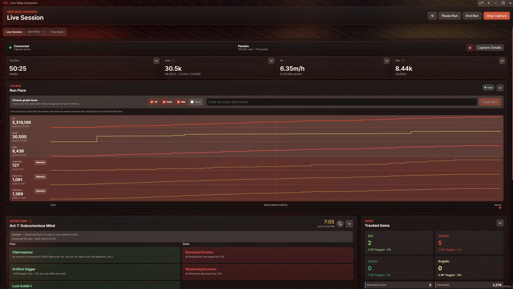
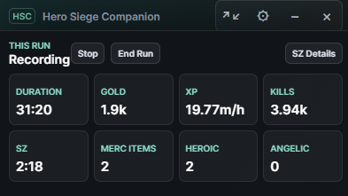
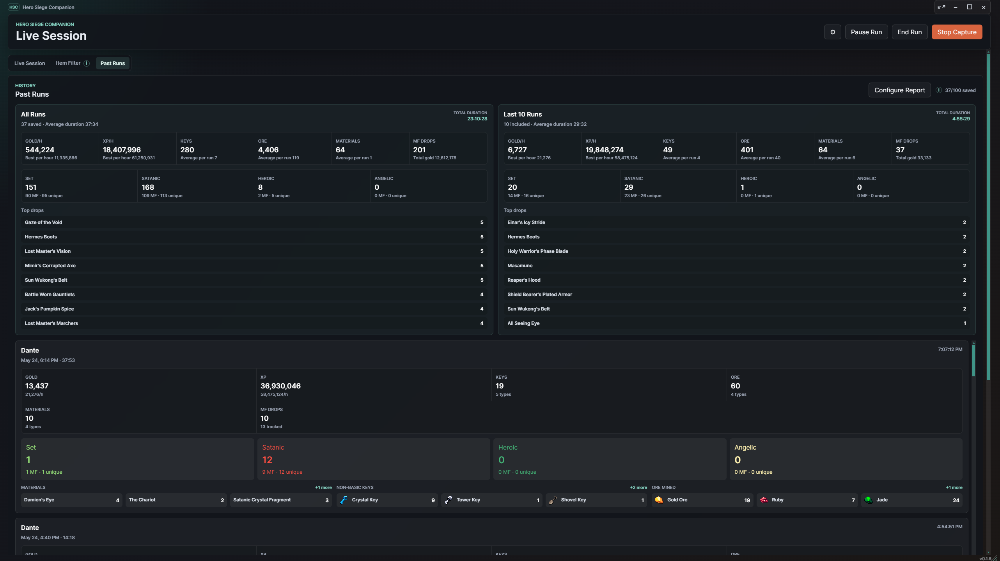
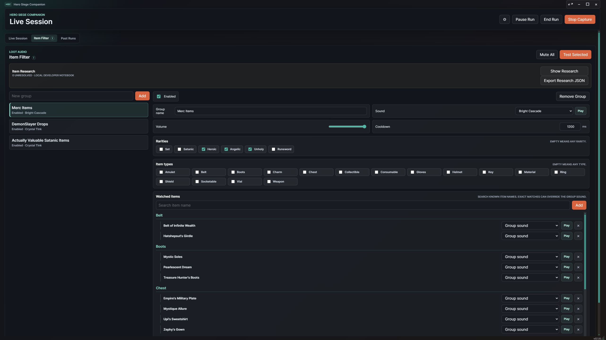
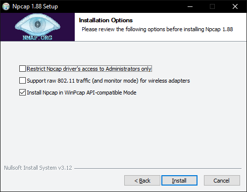

# Hero Siege Companion

Local live-session tracking for Hero Siege on Windows.

Hero Siege Companion passively watches local Hero Siege traffic, parses the game messages it understands, and turns them into the Live Session dashboard, Filter Stack for loot alerts, Market for saved item searches, and Report Desk for saved runs. A compact current-run overlay is also available. In 0.3.1, manual Satanic Zone Refresh is temporarily disabled; passive game-observed zone updates remain available.

> **Required before first launch:** install [Npcap](https://npcap.com/#download) so the companion can read local game traffic. The exact installer options are in [Required: Install Npcap](#required-install-npcap).



## Download

Download the latest Windows build from the GitHub Releases page:

[Hero Siege Companion Releases](https://github.com/DemonSkye/Hero-Siege-Companion/releases)

The release asset is the portable Windows build. Download it, unzip it if needed, and run `Hero Siege Companion.exe`.

Current local release candidate: **0.3.1**, matching `package.json`. Native game/server compatibility still needs owner testing before publication.

## Quick Start

1. Install [Npcap](https://npcap.com/#download) using the options shown below.
2. Launch `Hero Siege Companion.exe`.
3. Start Hero Siege and leave capture running while you play.
4. Open the Market tab or use `Market` on a recognized drop. Edit filters and press Search; save filters to return to them later.
5. Use `End Run` when a run is complete and should be saved to Past Runs.

Most data appears after Hero Siege sends the relevant packet. For example, gold may update after a zone change or town interaction, and Satanic Zone details normally arrive during world entry or through a later game-observed update.

Market checks become ready after capture observes current account, mode and session evidence. If context is missing, keep capture running and search for an item in Hero Siege's Market. Local readiness does not prove accepted authentication. Companion can attach during play; packets sent before capture began cannot be recovered.

## Core Features

- Live Session dashboard with capture status, packet counts, run timer, gold, XP, kills, readable Satanic Zone effects, tracked drops, and persistent timeline filters.
- Collapsible Run Pace charts with persistently hideable XP, gold, kills, and observed-item lanes, up to four saved exact-item lanes, and a shared exact-value inspector for live and saved runs.
- Run pause/resume controls, including automatic run pause when capture stops.
- Compact overlay mode for keeping the current run visible while playing, with tile presets and custom item/filter counters configured from the compact gear.
- Satanic Zone name, reset countdown, pros, cons, and freshness status in both full and compact views.
- Passive Satanic Zone effects and freshness remain available; manual Refresh and its sign-in settings are temporarily unavailable in 0.3.1.
- Market tab with catalog item selection, optional socket/stat minimums, saved filters and up to 20 gold-price listings from one returned page. Eligible Timeline drops open the same editor.
- Filter Stack loot alerts with independently collapsible groups, concise rule/sound summaries, rarity/type rules, exact watched items, volume, cooldown, and prominent global mute.
- Contextual Sound Library for built-in previews, imported local audio or zip soundpacks, usage-aware removal, and soundpack ZIP export; Filter Packs carry only the custom sounds their groups use.
- Dark, Demonsteel, Voidglass, Reliquary, Cyberpunk, and Quicksilver themes with canonical full-app and compact choices. Custom theme files are the advanced escape hatch; ordinary accent controls are not exposed.
- Existing shopping-list names migrate reversibly into saved Market items; unresolved names remain available to repair.
- Report Desk for Past Runs, with aggregate-first reporting, desktop master/detail navigation, responsive Back navigation, contextual run actions, search and tags, JSON/CSV export, Discord-friendly summary copy, report presets, linked Filter Stack groups, and resource/drop detail.
- One autosaving Settings ledger organized into App, Appearance, Features, Help & Support, and Developers; there is no Apply or Done step.
- Full backup and restore with a read-only preview and explicit confirmation for supported settings, item filters, imported sounds, custom themes, reports/layouts, and dashboard fixture visibility.
- Player-facing Item Research is retired. If legacy authored entries still exist, Developers offers a one-time export and clears them from current preferences only after that export succeeds.
- Support diagnostics summary copy, log folder opening, and sanitized ZIP export with app-session state and Crashpad report metadata (never dump memory) for troubleshooting capture/setup issues.
- Local-only desktop app: no account login, no cloud service, and no packet capture files are written by the app.

## Live Dashboard

The full-size Live Session tab keeps the **Run Command** information hierarchy without a separate Run Command banner. Its fixed run score keeps duration, gold, XP, and kills visible, while the support rail keeps high-rarity drop totals and diagnostics nearby. Capture details stay behind a contextual disclosure. Satanic Zone pros and cons sit in separate columns; within each column, every effect stacks a human-readable title over a short explanation.

The full-width, collapsible **Run Pace** graph sits between the score strip and the dashboard. It uses pause-aware time since graph tracking began and draws independently scaled step lanes for XP, gold, kills, and observed items. Each built-in lane can be shown or hidden, and you can add or remove up to four exact-item lanes from catalog suggestions or a freeform name; exact matching ignores case, accents, and punctuation. Hovering the graph shows a synchronized exact time/value readout for every visible lane, with the same inspection available from the keyboard time control. Its App-owned live view remains available when you switch tabs and resets its values for each new run, while the selected standard and exact-item lanes autosave and survive Companion relaunches and full backup/restore. Separately, the stats engine stores a bounded Run Pace history with each meaningful archived run, so an individual Past Run report can replay the enabled standard lanes and live exact-item choices, with current Report Desk trackers filling any unused custom-lane slots. Legacy runs remain unchanged and do not display invented chart data. If the renderer starts or recovers during an existing run, the live graph begins with the hydrated current snapshot instead of inventing earlier history; the main-process archive still retains accepted events from the observed run.

Item Timeline and Live Log are collapsible dashboard fixtures. Ordinary card collapse lasts for the current session. Hiding either fixture is a saved choice, and a gear-only dashboard customizer in the capture status row restores hidden fixtures. Item Timeline filters are also saved, including the socketable, key, material, unfiltered, type, and linked-filter choices. Eligible normal and unique drop rows also expose a `Market` action for an on-demand comparable-listing check.

Satanic Zone details in full and compact mode show zone names, pros, cons, observation age and expiry from the game's own captured traffic. Pausing run counters does not stop these updates. End Run clears the prior run's zone display; the next passive response repopulates it.

Manual SZ Refresh and its sign-in settings are temporarily unavailable in 0.3.1 while native Market coexistence is investigated. The release does not initialize the independent SZ provider or restore saved sign-in data, and legacy enable/Refresh/cache calls are blocked. Existing saved preferences, ciphertext and unlocking keys are left untouched. This does not establish the cause of the native compatibility issue.

## Market and Saved Filters

Open the `Market` tab to choose a normal or unique catalog item, or choose `Market` on an eligible Timeline drop to fill the same editor. Minimum sockets and known-stat minimums are optional and editable; rolled values are not guessed from a drop packet that does not expose them reliably. Save the item and filters locally, then load, edit, duplicate or delete the saved entry. Loading a saved item never searches automatically. Existing shopping-list names migrate without losing their original strings. See [Market behavior and migration](docs/market.md).

Each explicit Search fetches one page sorted by price ascending and shows up to 20 readable gold-price listings, with optional price per unit. Displayed, decoded page and server-returned counts remain distinct; results do not represent the entire market. Searches never automatically retry, poll, buy or request another page. Only one search may be in flight, with a 15-second minimum between submitted searches; the disabled Search button shows the remaining cooldown. Errors are reduced to safe states such as helper unavailable, template unavailable, pending, rejected, or timed out. Six captured fields establish local prerequisites; acceptance still depends on the server response. Editing filters or changing account/mode clears stale prices while preserving the draft.

Npcap structurally observes complete native API frames before gameplay parsing and collects only the six fields required for the current account/session/mode. This observation path is deliberately separate from loot, chat, and stats parsing. The main process qualifies the raw account ID with validated public region metadata, builds the checksum and fixed-route multipass locally, and sends one direct HTTPS request from a bounded Worker. It never decrypts or intercepts the game's HTTPS traffic.

Authentication context stays in memory, is bound to the observed game-process generation, account, mode, endpoint, and fresh crossregion evidence, and is cleared when capture stops or that scope changes. Public region metadata has an independent one-hour cache with bounded stale-if-error recovery. Sanitized listing results have a separate session-local 30-second, 64-entry LRU cache keyed by normalized filters and account/region/season/hardcore/beta scope; cache hits retain their original observation time, contain no seller or credential data, dispatch nothing, and consume no new network slot. Fresh requests still respect the 15-second dispatch gate.

## Compact Overlay

Compact mode is designed for playing with the companion on top of the game. It keeps the current run, gold, XP, kills, Satanic Zone timer, and optional custom counters visible without taking over the screen. Compact mode is always pinned; pinning the full-size window is a separate session-only choice.



Click `This Run` in compact mode to open the run details cover. Use `Pause`, `Resume`, and `End Run` without expanding back to the full desktop view. The compact title-bar gear is the only tile-layout editor: it applies default, loot, resource, or XP/kills presets; orders up to eight tiles; and adds exact-item or Filter Stack group counters. Duration remains included because run controls depend on it. The SZ timer opens passive zone details; no active Refresh control is shown in 0.3.1.

## Past Runs

Past Runs uses the **Report Desk** layout. The aggregate All Runs report opens by default, while the desktop keeps a run library and report paper together in one master/detail view. Left-clicking anywhere on a saved-run row opens its report without leaving the desk; the independent `…` menu owns secondary actions. Narrow layouts show the report with an explicit `Back to run library` action.



Use search and tags to narrow saved history by strategy, character, date, duration, resource, drop, gold, XP, or kills. The aggregate report follows that slice and includes total and average duration plus the configured summary and detail sections. Export JSON writes matching runs and their aggregate summary, Export CSV writes the current aggregate rows, and Copy Summary creates Discord-friendly text for the filtered result set or one saved run.

When a selected run matches the search, Report Desk highlights the matching character/date/duration header, stat, tag, drop, or resource in the report itself and marks matches for assistive technology. If matching report data is hidden by the current report configuration, it is temporarily projected into the searched report so every match remains visible even beyond the report's normal top-drop limit, without changing the saved run or report setup. There is no separate `Why this run is shown` explainer.

`Configure Report` offers default, gear, materials/ore, keys, magic-find, and Satanic Zone presets, plus linked Filter Stack groups and manual report items. Drop totals are tracked item drops, magic-find counts are server-provided flags, and unique counts mean distinct item names. Only truly empty sessions are discarded; history is newest-first and keeps a fixed maximum of 250 runs, evicting the oldest first.

## Item Filters And Sound Library

The Item Filter tab uses the **Filter Stack** layout. Each top-level alert group can collapse independently while keeping its enabled state and a concise rarity, type, watched-item, and sound summary visible. Groups match exact watched items first, then broader rarity/type rules. Group volume and cooldown limit alert noise, and the prominent global `Mute All` control suppresses audio without stopping matching.



The contextual Sound Library previews built-in and imported sounds, imports supported audio files or ZIP soundpacks, exports imported sounds as a soundpack, shows usage counts, and confirms removal. Removing an in-use custom sound keeps the filter rules and falls back to a built-in sound. Filter Packs are the sharing format for alert rules: export includes only custom sounds referenced by those groups, while import shows group, rule, sound, and fallback counts before adding anything. Existing groups and sounds remain untouched.

Player-facing Item Research, collection prompts, naming notebook, and cleanup controls are retired because the build-pinned catalog now resolves normal item identity. If previously authored research entries still exist, **Settings > Developers** exposes a one-time legacy export. A successful export clears those migration-only entries; ordinary players no longer configure or maintain research data.

## Settings And Configuration

Settings is one autosaving ledger. Choices save as they change, and the saved/saving state appears in the header; there is no separate Apply or Done step. Its five sections are:

- **App:** choose Steam, the default launch method, or Standalone. The executable path appears only when Standalone is selected.
- **Appearance:** choose the canonical Dark, Demonsteel, Voidglass, Reliquary, Cyberpunk, or Quicksilver theme for the full app and compact overlay. Pre-v2 overrides remain available as `Legacy Custom (Migrated)` when present, but ordinary accent, texture, and fill controls are retired.
- **Features:** explains passive Satanic Zone updates and the temporary manual Refresh unavailability.
- **Help & Support:** export or restore a full backup, manage automatic diagnostics plus manual or exact ten-minute Enhanced/Deep modes, open logs, create a support bundle, reset both saved window positions, factory-reset preferences, and read About/What's New.
- **Developers:** import/export custom themes, export a theme template, access theme token/schema references, and export legacy Item Research once when migration-only entries remain.

Compact tile layout is intentionally absent from Settings. Open the compact overlay and use its gear control to choose presets, order tiles, and configure custom counters.

Backup and restore is full-only rather than a checklist of configuration sections. A backup contains supported app choices, Item Filters, imported sounds, custom-theme data, report and compact-layout data, and hidden Live Session fixtures. Restoring first validates the selected file and shows a read-only count preview; nothing is applied and no embedded sound is installed until you confirm. Older supported configuration JSON is accepted, while retired options are ignored instead of being restored.

Restoring a backup cannot enable active Satanic Zone Refresh in this release. Factory reset also preserves Past Runs, diagnostic logs, Item Filters, and imported sounds by default; deleting filters is a separate unchecked choice.

Settings, What's New, Item Filter confirmation, and Past Runs report dialogs keep keyboard focus inside the open dialog and return focus to the invoking control when closed.

## Required: Install Npcap

Hero Siege Companion uses the Windows packet capture driver provided by Npcap. Install Npcap before running the app. Npcap is used only to read traffic; the manual refresh feature does not inject raw TCP frames through Npcap.

Download Npcap from the official Npcap site:

[https://npcap.com/#download](https://npcap.com/#download)

During setup, use these options:

- Leave **Restrict Npcap driver's access to Administrators only** unchecked.
- Check **Install Npcap in WinPcap API-compatible Mode**.
- The raw 802.11 wireless option is not required for Hero Siege Companion.



If capture does not start, reinstall Npcap with the WinPcap-compatible option enabled, then restart Hero Siege Companion.

## Direct Network Features

Market checks use Npcap to observe current game-owned API context and send one explicit direct HTTPS request. Product capture continues to exclude ports 80 and 443 and never writes or injects raw packets. Passive SZ updates send no separate authentication. No helper process modifies the game's connection.

No mitmproxy installation, local CA certificate, WinDivert redirector, interception UAC prompt, privileged service, proxy configuration, reconnect, or requirement to launch Hero Siege through Companion remains. Requests are unavailable when their required inputs are incomplete, and invalid responses are reported safely. Missing current context blocks Market searches; active SZ authentication remains unavailable. Attaching during play remains supported, but packets sent before capture began cannot be recovered.

## Development

Install dependencies:

```powershell
$env:npm_config_cache='.npm-cache'
npm install --ignore-scripts
```

Install Electron into the local cache:

```powershell
$env:electron_config_cache=(Join-Path (Get-Location) '.electron-cache')
npm run postinstall:electron
```

Rebuild the native packet capture module. This command first applies the required Windows close-retention and no-current-context teardown repairs, then invokes Electron Rebuild. It requires Python on your `PATH`; Python 3.10+ is a good default on Windows.

```powershell
npm run rebuild
```

If Python is installed but not on `PATH`, point npm at your local `python.exe` first:

```powershell
$env:npm_config_python='C:\Path\To\Python\python.exe'
npm run rebuild
```

Run the app:

```powershell
npm start
```

For development of Market checks or passive SZ display, keep Npcap installed and capture running long enough to observe qualifying traffic. Active SZ implementations and historical tests are retained for investigation, but the release capability is off. No separate proxy runtime is used.

Run tests:

```powershell
npm test
```

For changes to capture, sign-in context, readiness or authenticated requests, add a
representative mocked traffic journey through the real framing, TCP reassembly,
context, readiness and response code. Inventory retained sanitized evidence first;
use observed structure where available and label substituted bytes, added
fragmentation and missing captures explicitly. Mock platform I/O rather than Ready.
Verify that passive collection sends nothing, only the explicit action dispatches,
and lost observation or identity changes fail closed. Keep actual authentication
values, raw captures and private endpoints out of fixtures, logs and app Git.
[Replay evidence and coverage](tests/fixtures/NETWORK_REPLAY.md) distinguish offline
acceptance from Windows/game/server acceptance.

Run strict main and renderer typechecks:

```powershell
npm run typecheck
```

Run the headless Electron E2E suite:

```powershell
npm run test:electron
```

Build the portable Windows release:

```powershell
npm run dist:win
```

## Notes

Npcap is developed by the Nmap Project. Hero Siege Companion is not affiliated with Hero Siege, Panic Art Studios, Nmap, or Npcap.
