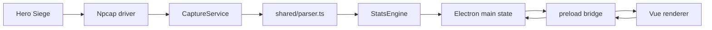

# Hero Siege Companion Project Overview

Last updated: 2026-05-25 for `0.2.0`.

This document describes the app as it stands today. It is intended for maintainers, not end users.

## Purpose

Hero Siege Companion is a Windows Electron app that passively watches local Hero Siege traffic through Npcap, parses the game messages it understands, and presents session stats in a Vue dashboard.

The app is intentionally local-first:

- No account login.
- No cloud service.
- No packet capture files are written during normal use.
- Persistent app data is limited to preferences, window bounds, run summaries, optional item research notes, and optional debug logs.
- Imported loot alert sounds are copied into local userData.
- Support diagnostics ZIPs are generated locally and do not include packet capture files.

## Runtime Shape

## Source Map

- `src/main/main.ts`
  Owns IPC handler registration, app state, run lifecycle, capture update batching, and state publishing. Window creation/modes, game launch/capture coordination, sound import/remove, support diagnostics, release update checks, dialogs, and JSON persistence are delegated to focused main-process modules.
- `src/main/game-capture-coordinator.ts`
  Owns Steam/executable launch requests, delayed post-launch capture retries, game-process monitoring, and capture auto-start throttling.
- `src/main/window-manager.ts`
  Owns BrowserWindow creation, compact/full bounds, titlebar actions, always-on-top behavior, and renderer recovery.
- `src/main/electron-dialogs.ts`
  Wraps parent-window aware Electron open/save dialogs.
- `src/main/capture.ts`
  Owns Npcap capture lifecycle, adapter/filter selection, parser safety, generated-drop correlation, dedupe state, health emission, and capture diagnostics.
- `src/main/capture-network.ts`
  Discovers Hero Siege/Easy Anti-Cheat process IDs, reads active TCP connections, filters likely game-server connections, and creates stable capture filters/signatures.
- `src/main/packet-decoder.ts`
  Decodes supported link-layer IPv4/TCP packets, screens parseable payload text, and assembles split TCP payloads.
- `src/main/capture-events.ts`
  Holds pure capture event helper rules for fingerprints, summaries, generated-item trust checks, and debug payload selection.
- `src/main/capture-debug.ts`
  Writes local diagnostic JSONL logs and redacts sensitive debug snippets.
- `src/main/app-diagnostics.ts`
  Writes app debug logs, session heartbeat files, previous-session diagnostics, and app heartbeat entries.
- `src/main/json-file-dialogs.ts`
  Shared JSON open/save dialog helpers for configuration and item research flows.
- `src/main/sound-import.ts`
  Imports local loot alert sounds and zip soundpacks into userData.
- `src/main/support-diagnostics.ts`
  Builds support diagnostics metadata and diagnostics ZIP files.
- `src/main/release-updates.ts`
  Checks GitHub Releases and compares app versions.
- `src/main/persistence.ts`
  Loads, saves, normalizes, and migrates Past Runs, main-process preferences, and window bounds.
- `src/main/preload.ts`
  Exposes the safe `window.heroSiegeCompanion` API to Vue.
- `src/shared/initial-state.ts`
  Shared default preferences and `CompanionState` factory for main and renderer.
- `src/shared/ipc.ts`
  Shared IPC channel constants and preload API type.
- `src/shared/parser.ts`
  Converts raw payload text or decoded objects into typed `ParsedEvent` records.
- `src/shared/stats.ts`
  Applies parsed events to live session stats and creates saved run summaries, including tag-ready `PastRunSummary` records.
- `src/shared/support-diagnostics.ts`
  Shared contracts for support diagnostics metadata and ZIP save results.
- `src/shared/*lookup*.ts`, `item-rarity.ts`, `set-item-names.ts`, `item-icons.ts`
  Static item, stack item, rarity, set-item, and icon lookup data.
- `src/renderer/src/App.vue`
  Coordinates the main renderer state subscription, high-level tabs, run/capture actions, settings/configuration actions, and prop/event wiring. Preference drafts, session display projections, shopping-list runtime, support diagnostics runtime, window/compact mode, item filter runtime, item research runtime, toast/update/What's New state, and theme DOM application are delegated to renderer helpers.
- `src/renderer/src/components/*`
  Presentational Vue components for shell chrome, Live dashboard panels, Past Runs cards/report panels, Settings tabs, Item Filter, Compact, update banner, and What's New prompt views.
- `src/renderer/src/lib/*`
  Renderer helpers for formatting, DOM event value helpers, preferences, session display projections, item filter runtime, item research runtime, item options, item assets, log display, sounds, themes/theme application, toast/update/What's New state, support diagnostics summary/runtime, shopping-list helpers/runtime, window mode, past-run search/tag behavior, and past-run aggregation.
- `src/renderer/src/styles.css`, `src/renderer/src/styles/*.css`
  Ordered style manifest plus feature CSS modules for base shell, compact, live dashboard, item filter, activity lists, Past Runs, settings, theme-token overrides, and responsive rules.
- `src/renderer/src/lib/theme-presets/*`
  Dark, Cyberpunk, and Light theme definitions.
- `src/renderer/src/styles/themes/*`, `src/renderer/src/styles/compact-themes/*`
  Theme-specific CSS layered on top of the feature CSS modules.
- `tests/**`
  Vitest unit and component tests. See `docs/testing.md`.

## Main Process Flow

`main.ts` keeps a single in-memory `CompanionState`. Renderer windows request the current state through `state:get`, and state changes are pushed through `state:updated`.

Important IPC areas:

- Capture: `capture:start`, `game:launch-or-capture`, `capture:stop`.
- Stats/run: `stats:reset`, `run:pause`, `run:resume`.
- Past Runs: `past-runs:set-tags`.
- Preferences: `preferences:set-run-archive`, `preferences:set-capture`, configuration import/export helpers, item research export.
- Sounds: `sounds:import`, `sounds:remove`.
- Support: `support:get-diagnostics-info`, `support:save-diagnostics`, `docs:open-npcap-guide`.
- Window controls: minimize, maximize, close, always-on-top, compact mode.
- Utility: clipboard write, game executable chooser.
- Updates: check latest GitHub release and open release URL.

Run summaries are created when the user ends a run or when the app closes. Saving is controlled by run archive preferences:

- `skipEmptyRuns`
- `minDurationMinutes`

The main process also stores and restores window bounds separately for full and compact modes.

Runs can be recording or paused. Manual pause/resume is exposed in both full and compact UI. Stopping capture automatically pauses the current run with a `captureStopped` reason; if capture starts again while that pause reason is active, the run resumes automatically. Run duration and per-hour rates exclude paused time.

Saved runs can be tagged from Past Runs. Tags are normalized, deduped, bounded, and saved with `past-runs.json`.

## Capture Flow

`CaptureService` does four jobs:

1. Detect Hero Siege and Easy Anti-Cheat process/network state with `capture-network.ts`.
2. Select likely game-server TCP connections while ignoring launcher/CDN/web traffic.
3. Open an Npcap capture on an adapter/link type that can be decoded.
4. Decode TCP payloads with `packet-decoder.ts`, assemble application messages, parse them, dedupe events, and emit updates.

Capture states:

- `idle`: no active capture.
- `waiting`: capture was requested but the app is waiting for Hero Siege, anti-cheat, or game-server connections.
- `running`: Npcap is open and packets are being inspected.
- `error`: capture failed or parser recovery could not reopen cleanly.

Packet decoding supports these link types:

- `ETHERNET`
- `RAW`
- `NULL`
- `LINKTYPE_LINUX_SLL`

Payload assembly uses TCP acknowledgement/order context so split payloads can be reconstructed before parsing.

Parser safety is defensive:

- Oversized payloads are rejected.
- Parser failures are counted and logged.
- Repeated parser failures trigger capture recovery.
- Recent event fingerprints prevent duplicate stats updates from repeated packet observations.

## Debug Logging

Normal use does not write packet capture files. Debug logging is text/JSON diagnostics only.

Main logs:

- `app-debug.log`
- `capture-debug.log`

Verbose live logging additionally writes:

- `capture-wide-debug.log`

Wide debug logging is controlled by the `createDebugMode` capture preference. It records packet and assembled-payload diagnostics to help investigate loot correlation and parser gaps.

## Generated Drop Correlation

Hero Siege can emit generated `itemData` payloads that do not always mean an item was actually picked up or dropped.

The current behavior is:

- Inventory/pickup-shaped `itemData` is treated as an inventory item event.
- Server "just found [item]" messages are treated as dropped item events.
- Generated ground placeholders are ignored unless the app has evidence they belong to an actual trusted drop.
- Outbound `inventory/item_generate/v1` requests create a short-lived pending generated-drop context.
- Matching inbound generated `itemData` responses are marked trusted and can produce `itemDropped` events.

This is intentionally conservative because early versions counted some generated ground snapshots as real drops.

## Parser Responsibilities

`captureMessages` extracts message objects from raw text. It handles:

- JSON objects and arrays embedded in noisy packet text.
- Query-string payloads.
- Query-string values containing nested JSON.
- Special base64 item payloads.
- Loose currency payloads where packet framing is corrupt but readable currency fields remain.

`messageToEvents` normalizes messages into events:

- `updateGold`
- `updateXP`
- `updateMail`
- `updateSatanicZone`
- `updateAccount`
- `updateAccountMode`
- `itemAdded`
- `itemDropped`

Parser helpers are deliberately tolerant of field names because Hero Siege payloads have changed shape over time. Snake case, camel case, renamed fields, and short fields are all supported where known.

## Item Handling

Item identity is resolved from the strongest available source:

- Explicit trusted name.
- Fingerprint-inferred item type.
- Explicit type/id/weapon type.
- Stack item lookup for materials, keys, gems, and socketables.
- Known rarity map when packet rarity is missing, common, superior, rare, or mythic but the item name is known.

Inventory events are trusted more than generated ground snapshots. Untrusted generated item data does not get to use named identity for rare drop counters unless it is correlated or otherwise trusted.

Tracked drop counters focus on:

- Set
- Satanic
- Heroic
- Angelic

Material-like and key/socketable items can appear in the item timeline but do not increment rare-drop cards.

Unknown/generic item labels such as `Collectible #24` can be recorded in the optional developer item research notebook. Resolved names are normalized against known item options where possible, title-cased otherwise, and exported with both a display name and normalized lookup key for community lookup updates.

## Stats Engine

`StatsEngine` applies parsed events to a session snapshot.

Tracked session data:

- Character/account name.
- Current season/gold mode.
- Current gold.
- Gold earned from positive deltas.
- XP earned.
- Mail status.
- Satanic Zone details.
- Rare drop totals and magic-find totals.
- Per-item drop breakdowns.
- Non-basic keys.
- Ore/material counters.
- Item timeline.
- Paused run duration.

Important guardrails:

- Gold mode changes reset the gold baseline instead of counting cross-mode totals as earned.
- Item fingerprints dedupe repeated item events.
- Only selected rare item types contribute to rare-drop counters.
- The timeline is capped to avoid unbounded renderer growth.
- Per-hour rates use active run duration, excluding manual or capture-stopped pauses.

## Renderer Flow

`App.vue` is now a top-level orchestration component. It holds the main state subscription, high-level view state, settings/configuration actions, and prop/event wiring, while preference drafts, session display projections, shopping-list runtime, support diagnostics runtime, window/compact mode, item filter runtime, item research runtime, toast/update/What's New state, and theme DOM application live in focused helpers.

Renderer views:

- Live dashboard
  Displays capture state, collapsible metrics, collapsible zone data, tracked drops, item timeline, shopping list, item filter summary, live log, and Npcap setup checklist.
- Past Runs
  Displays saved run aggregates, search, tag filters, per-run tag editing, configurable report cards, tracked item groups, top drops, run cards, per-rarity breakdowns, keys, materials, and ores.
- Item Filter
  Manages loot audio groups, rarity/type rules, exact watched items, per-item sounds, imported custom sounds, cooldowns, mute state, and optional item research.
- Settings
  Manages log/timeline limits, game launch mode, capture details, verbose logging, appearance/themes, sounds, support diagnostics, window behavior, timeline filters, run archive rules, developer item research flags, and configuration import/export.
- Compact View
  Small overlay-style view for capture state, this-run time, run pause/end controls, gold, XP rate, Satanic Zone timer/details, shopping list, and compact run details.
- Update Banner
  Shows available GitHub release updates and lets the user open or ignore them.

## Renderer Persistence

Renderer preferences are stored in `window.localStorage`:

- Log/timeline limits.
- Capture details visibility.
- Always-on-top.
- Compact window position lock.
- Timeline filters.
- Shopping list.
- Game executable path and Steam launch preference.
- Item filter groups and mute state.
- Imported custom sound references.
- Full/compact theme choices, accent colors, and optional theme tokens.
- Post-run report configuration.
- Optional item research entries.
- Configuration import/export checkbox state.

Main-process preferences are stored in the Electron user data `preferences.json`:

- Run archive rules.
- Capture debug mode.

Past runs are stored in `past-runs.json`.

Imported sounds are stored under Electron userData `sounds`.

## Item Filter Audio

Item filter matching runs against new timeline items after the app opens.

Matching order:

1. Exact watched item names.
2. Group rarity/type rules.

Exact watched items can override the group sound. Groups have cooldowns so repeated matching drops do not spam audio.

Built-in sounds are generated in the renderer with Web Audio oscillators/noise buffers. Imported custom sounds are copied into userData and played through `Audio`.

## Post-Run Reports

Past Runs uses a local report configuration to decide what appears in aggregate and per-run recaps:

- Summary cards such as gold, XP, keys, ore, materials, and magic-find drops.
- Rarity groups included in item recaps.
- Custom item groups with enabled/disabled state, rarity filters, and exact watched items.
- Resource drawers for materials, non-basic keys, and mined ore.
- Top-drop list size.

Enabled custom item groups are combined for report tracking. If no enabled group has exact items, the report falls back to the selected rarity groups.

When search is active, aggregate panels summarize matching runs rather than every saved run.

## Item Research

Developer item research is opt-in. When enabled, generic or unresolved item signatures can be added from the item timeline or captured automatically when the prompt setting is enabled.

The research notebook stores:

- Stable signature.
- Generic label, rarity, type, id, and drop quality.
- Seen count and timestamps.
- Resolved item name and notes.

Research export writes a standalone JSON payload intended for sharing through GitHub Gist. It is separate from general configuration export so users can share lookup data without sharing personal settings.

## Shopping List

The shopping list is a local convenience feature for quickly copying item names. It is not market automation.

Known item names come from:

- Default materials.
- Stack item translations.
- Item translations.
- Item icon names.

The stack lookup now includes `The Wheel of Fortune` for collectible `type 13 / id 24`.

## Updates

The main process checks GitHub Releases for newer versions and returns a `ReleaseUpdateInfo` object to the renderer. The renderer stores an ignored version in local storage so users can dismiss a release banner.

The renderer also has local What's New copy for the current app version and stores the last-seen version in local storage.

## Build And Packaging

Important scripts:

- `npm run build`
  Builds main and renderer output.
- `npm start`
  Builds and starts Electron.
- `npm test`
  Runs Vitest unit/component tests.
- `npm run dist:win`
  Prepares the native capture module, builds, and packages the portable Windows executable.

Electron Builder output is configured as a portable Windows x64 build named `Hero Siege Companion.exe`.

Current verification on 2026-05-25:

- `npm --prefix .\hero-siege-companion test`: `107` passing tests across `18` spec files.
- `tsc -p .\hero-siege-companion\tsconfig.main.json --noEmit --noUnusedLocals --noUnusedParameters`: passed.
- `npm --prefix .\hero-siege-companion run build`: passed with no large renderer chunk warning; largest observed JS chunk is `103.11 kB` minified (`item-lookup`).
- Packaging was not rerun.

## Maintenance Notes

- Root-level development guardrails live in `..\PROJECT_RULES.md`; read them before non-trivial changes.
- Keep parser tests packet-shaped. Real payload oddities are the best regression fixtures.
- Treat generated itemData carefully; it has caused false drop counts before.
- Do not move user-facing feature detail into this document only; README should stay current for release/download users.
- Prefer adding renderer logic to `src/renderer/src/lib` and component state contracts to `src/renderer/src/components` rather than growing `App.vue` again.
