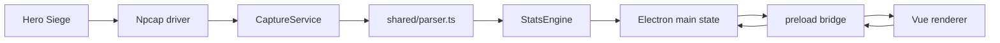

# Hero Siege Companion Project Overview

Last updated: 2026-05-23 for `0.1.4`.

This document describes the app as it stands today. It is intended for maintainers, not end users.

## Purpose

Hero Siege Companion is a Windows Electron app that passively watches local Hero Siege traffic through Npcap, parses the game messages it understands, and presents session stats in a Vue dashboard.

The app is intentionally local-first:

- No account login.
- No cloud service.
- No packet capture files are written during normal use.
- Persistent app data is limited to preferences, window bounds, run summaries, and optional debug logs.

## Runtime Shape

## Source Map

- `src/main/main.ts`
  Owns Electron windows, IPC handlers, app state, run persistence, preference persistence, launch/update helpers, and window mode changes.
- `src/main/capture.ts`
  Owns Npcap setup, process/connection detection, packet decoding, payload assembly, parser safety, debug logs, generated-drop correlation, and capture diagnostics.
- `src/main/preload.ts`
  Exposes the safe `window.heroSiegeCompanion` API to Vue.
- `src/shared/parser.ts`
  Converts raw payload text or decoded objects into typed `ParsedEvent` records.
- `src/shared/stats.ts`
  Applies parsed events to live session stats and creates saved run summaries.
- `src/shared/*lookup*.ts`, `item-rarity.ts`, `set-item-names.ts`, `item-icons.ts`
  Static item, stack item, rarity, set-item, and icon lookup data.
- `src/renderer/src/App.vue`
  Coordinates renderer state, preferences, tabs, compact mode, item filtering, shopping list behavior, and main-process calls.
- `src/renderer/src/components/*`
  Presentational Vue components for Live, Past Runs, Item Filter, Settings, Compact, and Update Banner views.
- `src/renderer/src/lib/*`
  Renderer helpers for formatting, preferences, item filters, item options, item assets, log display, sounds, and past-run aggregation.
- `tests/**`
  Vitest unit and component tests. See `docs/testing.md`.

## Main Process Flow

`main.ts` keeps a single in-memory `CompanionState`. Renderer windows request the current state through `state:get`, and state changes are pushed through `state:updated`.

Important IPC areas:

- Capture: `capture:start`, `game:launch-or-capture`, `capture:stop`.
- Stats: `stats:reset`.
- Preferences: `preferences:set-run-archive`, `preferences:set-capture`.
- Window controls: minimize, maximize, close, always-on-top, compact mode.
- Utility: clipboard write, game executable chooser.
- Updates: check latest GitHub release and open release URL.

Run summaries are created when the user ends a run or when the app closes. Saving is controlled by run archive preferences:

- `skipEmptyRuns`
- `minDurationMinutes`

The main process also stores and restores window bounds separately for full and compact modes.

## Capture Flow

`CaptureService` does four jobs:

1. Detect Hero Siege and Easy Anti-Cheat process/network state with PowerShell.
2. Select likely game-server TCP connections while ignoring launcher/CDN/web traffic.
3. Open an Npcap capture on an adapter/link type that can be decoded.
4. Decode TCP payloads, assemble application messages, parse them, dedupe events, and emit updates.

Capture states:

- `idle`: no active capture.
- `waiting`: capture was requested but the app is waiting for Hero Siege, anti-cheat, or game-server connections.
- `running`: Npcap is open and packets are being inspected.
- `error`: capture failed or parser recovery could not reopen cleanly.

Packet decoding supports these link types:

- `ETHERNET`
- `RAW`
- `NULL`
- `LINKTYPE_LINUX_SLL`

Payload assembly uses TCP acknowledgement/order context so split payloads can be reconstructed before parsing.

Parser safety is defensive:

- Oversized payloads are rejected.
- Parser failures are counted and logged.
- Repeated parser failures trigger capture recovery.
- Recent event fingerprints prevent duplicate stats updates from repeated packet observations.

## Debug Logging

Normal use does not write packet capture files. Debug logging is text/JSON diagnostics only.

Main logs:

- `app-debug.log`
- `capture-debug.log`

Verbose live logging additionally writes:

- `capture-wide-debug.log`

Wide debug logging is controlled by the `createDebugMode` capture preference. It records packet and assembled-payload diagnostics to help investigate loot correlation and parser gaps.

## Generated Drop Correlation

Hero Siege can emit generated `itemData` payloads that do not always mean an item was actually picked up or dropped.

The current behavior is:

- Inventory/pickup-shaped `itemData` is treated as an inventory item event.
- Server "just found [item]" messages are treated as dropped item events.
- Generated ground placeholders are ignored unless the app has evidence they belong to an actual trusted drop.
- Outbound `inventory/item_generate/v1` requests create a short-lived pending generated-drop context.
- Matching inbound generated `itemData` responses are marked trusted and can produce `itemDropped` events.

This is intentionally conservative because early versions counted some generated ground snapshots as real drops.

## Parser Responsibilities

`captureMessages` extracts message objects from raw text. It handles:

- JSON objects and arrays embedded in noisy packet text.
- Query-string payloads.
- Query-string values containing nested JSON.
- Special base64 item payloads.
- Loose currency payloads where packet framing is corrupt but readable currency fields remain.

`messageToEvents` normalizes messages into events:

- `updateGold`
- `updateXP`
- `updateMail`
- `updateSatanicZone`
- `updateAccount`
- `updateAccountMode`
- `itemAdded`
- `itemDropped`

Parser helpers are deliberately tolerant of field names because Hero Siege payloads have changed shape over time. Snake case, camel case, renamed fields, and short fields are all supported where known.

## Item Handling

Item identity is resolved from the strongest available source:

- Explicit trusted name.
- Fingerprint-inferred item type.
- Explicit type/id/weapon type.
- Stack item lookup for materials, keys, gems, and socketables.
- Known rarity map when packet rarity is missing, common, superior, rare, or mythic but the item name is known.

Inventory events are trusted more than generated ground snapshots. Untrusted generated item data does not get to use named identity for rare drop counters unless it is correlated or otherwise trusted.

Tracked drop counters focus on:

- Set
- Satanic
- Heroic
- Angelic

Material-like and key/socketable items can appear in the item timeline but do not increment rare-drop cards.

## Stats Engine

`StatsEngine` applies parsed events to a session snapshot.

Tracked session data:

- Character/account name.
- Current season/gold mode.
- Current gold.
- Gold earned from positive deltas.
- XP earned.
- Mail status.
- Satanic Zone details.
- Rare drop totals and magic-find totals.
- Per-item drop breakdowns.
- Non-basic keys.
- Ore/material counters.
- Item timeline.

Important guardrails:

- Gold mode changes reset the gold baseline instead of counting cross-mode totals as earned.
- Item fingerprints dedupe repeated item events.
- Only selected rare item types contribute to rare-drop counters.
- The timeline is capped to avoid unbounded renderer growth.

## Renderer Flow

`App.vue` is now an orchestration component. It holds renderer-side UI state and passes explicit props/events into focused components.

Renderer views:

- Live dashboard
  Displays capture state, metrics, zone data, tracked drops, item timeline, shopping list, item filter summary, and live log.
- Past Runs
  Displays saved run aggregates, top drops, run cards, per-rarity breakdowns, keys, and ores.
- Item Filter
  Manages loot audio groups, rarity/type rules, exact watched items, per-item sounds, cooldowns, and mute state.
- Settings
  Manages log/timeline limits, game launch mode, capture details, verbose logging, window behavior, timeline filters, and run archive rules.
- Compact View
  Small overlay-style view for capture state, session time, gold, XP, zone timer, rare drop counts, ore count, and shopping list.
- Update Banner
  Shows available GitHub release updates and lets the user open or ignore them.

## Renderer Persistence

Renderer preferences are stored in `window.localStorage`:

- Log/timeline limits.
- Capture details visibility.
- Always-on-top.
- Compact window position lock.
- Timeline filters.
- Shopping list.
- Game executable path and Steam launch preference.
- Item filter groups and mute state.

Main-process preferences are stored in the Electron user data `preferences.json`:

- Run archive rules.
- Capture debug mode.

Past runs are stored in `past-runs.json`.

## Item Filter Audio

Item filter matching runs against new timeline items after the app opens.

Matching order:

1. Exact watched item names.
2. Group rarity/type rules.

Exact watched items can override the group sound. Groups have cooldowns so repeated matching drops do not spam audio.

Sounds are generated in the renderer with Web Audio oscillators/noise buffers. There are no bundled sound files.

## Shopping List

The shopping list is a local convenience feature for quickly copying item names. It is not market automation.

Known item names come from:

- Default materials.
- Stack item translations.
- Item translations.
- Item icon names.

## Updates

The main process checks GitHub Releases for newer versions and returns a `ReleaseUpdateInfo` object to the renderer. The renderer stores an ignored version in local storage so users can dismiss a release banner.

## Build And Packaging

Important scripts:

- `npm run build`
  Builds main and renderer output.
- `npm start`
  Builds and starts Electron.
- `npm test`
  Runs Vitest unit/component tests.
- `npm run dist:win`
  Prepares the native capture module, builds, and packages the portable Windows executable.

Electron Builder output is configured as a portable Windows x64 build named `Hero Siege Companion.exe`.

## Maintenance Notes

- Keep parser tests packet-shaped. Real payload oddities are the best regression fixtures.
- Treat generated itemData carefully; it has caused false drop counts before.
- Do not move user-facing feature detail into this document only; README should stay current for release/download users.
- Prefer adding renderer logic to `src/renderer/src/lib` and component state contracts to `src/renderer/src/components` rather than growing `App.vue` again.
